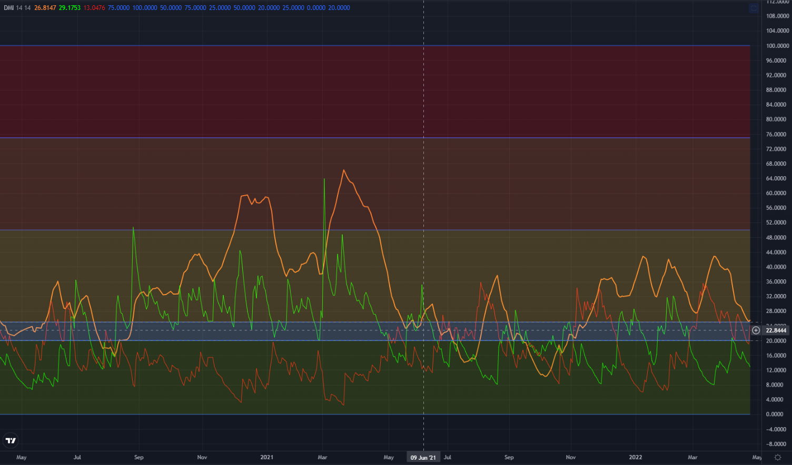

Did some modification of original DMI pine script to identify the ADX weak & very weak trend area.

|ADX Value|Trend Strength|
|---------|--------------|
|0-20|Absent or Very Weak Trend|
|20-25|Weak Trend / Bull & Bear Decision Making Phase|
|25-50|Strong Trend|
|50-75|Very Strong Trend|
|75-100|Extremely Strong Trend|

