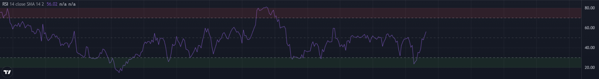

Did some modification of original RSI pine script to identify the RSI overbrought & oversold zone.

|RSI Value|Zone|
|---------|--------------|
|<20|Strong Oversold Zone|
|20-30|Oversold Zone|
|50|Bull/Bear Border Line|
|70-80|Overbrought Zone|
|>80|Strong Overbrought Zone|

